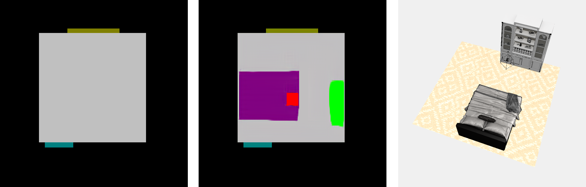
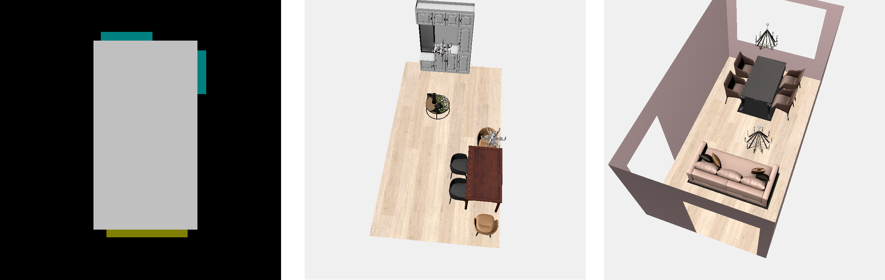
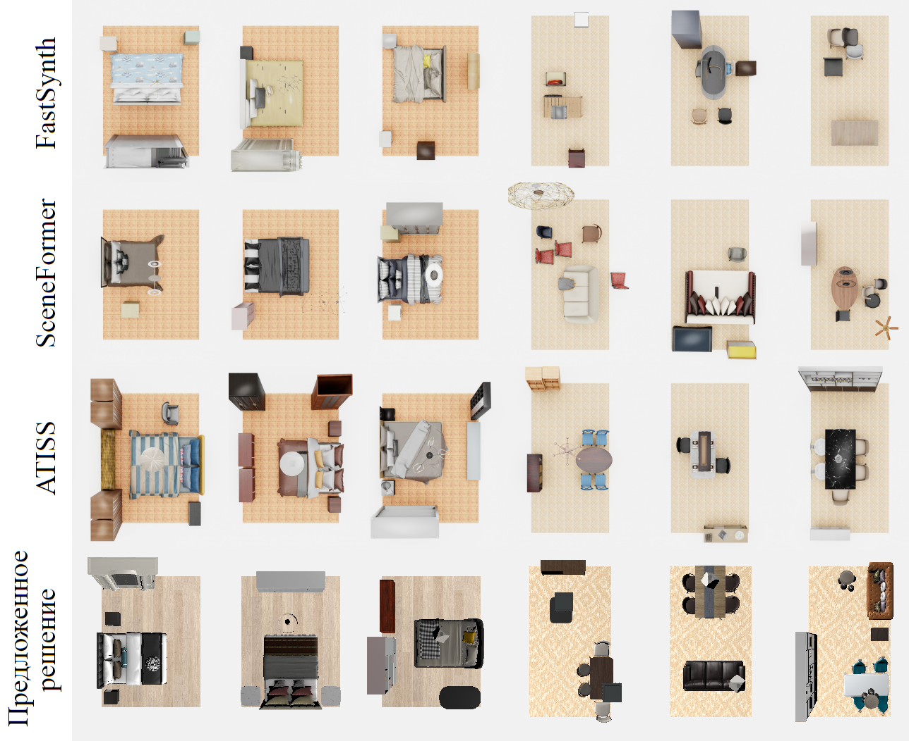

## Примеры использования разработанного сервиса

На изображении ниже приведен пример визуализации сгенерированного интерьера для спальной комнаты.
Требования по мебели - кровать, шкаф и освещение. Требования по стилю нет, стены не отображаются.


Запуск `generate.py` создает изображение комнаты с мебелью, основанное на сегментации (`--bed` является
требованием на наличие кровати, и т.д.):

```bash
python generate.py --path_to_label ... --path_to_output ... --bed --cabinet --lighting
```

Запуск `render.py` создает визаулизацию. Режим просмотра автоматический (вращение комнаты). Ниже приведены изоюражения,
полученные с помощью этого метода.

```bash
python render.py --path_to_image ... --path_to_label ... --render_mode auto --style None
```



Аналогично создаются визуализации интерьеров для гостиной-столовой (изображение ниже: два примера для различной мебели. На первом изображении стены скрыты,
стиль не задан. На втором изображении - задан стиль, стены и цвет для стен).

```bash
python generate.py --path_to_label ... --path_to_output ... --table --chair --cabinet --lighting
```

```bash
python generate.py --path_to_label ... --path_to_output ... --table --chair --sofa --lighting
```

```bash
python render.py --path_to_image ... --path_to_label ... --render_mode auto --style None
```

```bash
python render.py --path_to_image ... --path_to_label ... --render_mode auto --style "Vintage/Retro" --render_walls --wall_color "#E8C7C7"
```



Данные изображения были задействованы в примерах пояснительной записки (Рисунки 15, 16. Для рисунка 16 (и для других сравнений)
камера при рендеринге помещалась над комнатой).
scene-diversity-example



Пример сохранения `.gif` изображения.


